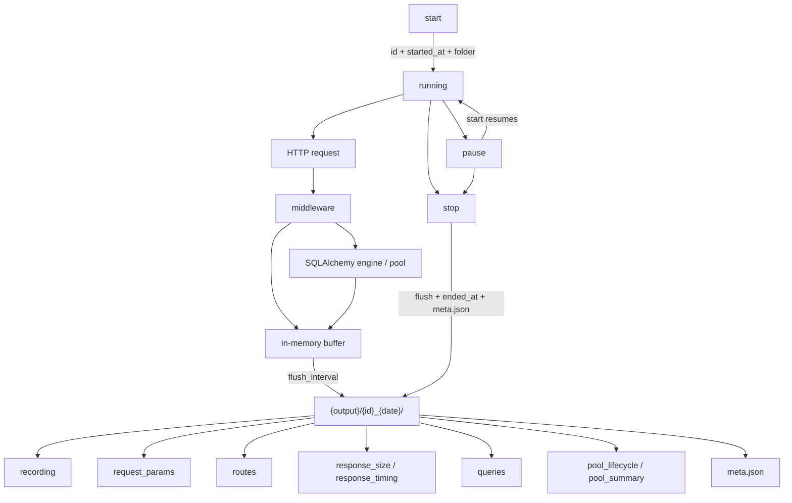

# SQL Alchemy Specter

> ⚠️ **Very early / WIP.** Barely past prototype. Things are subject to change, names will change.

**sql-alchemy-specter** is a profiling and load-simulation toolkit for FastAPI + SQLAlchemy apps — especially large, multi-thousand-user monoliths. SQLAlchemy makes the ORM look simple, but under real traffic the cost is spread across request shape, app/serialization time, pool health, query cost, and how those layers interact when hundreds of requests compete for connections.

Spectre captures that full linked chain (route → query → pool → response) so you can reproduce production-like load, attribute latency across layers, and close the loop: change, benchmark, validate against a baseline, ship.

**Quick links:** [Quickstart](QUICKSTART.md) · [example-api](example-api/README.md) · [Changelog (August)](changelog/august.md) · [Docs](docs/Overview.md) · [Package layout](src/sqlspectre/README.md)

## Setup

### 1. Wire it up

`configure` + `attach`. No hand-rolled middleware, no changes inside your handlers.

```python
import os
import sqlspectre
from fastapi import FastAPI
from sqlalchemy import create_engine

engine = create_engine(DATABASE_URL)
app = FastAPI()

sqlspectre.configure(
    output="./spectate",
    output_format="csv",                 # or "ndjson"
    enabled=os.getenv("SPECTRE") == "1", # False → attach is a no-op
    flush_interval=10.0,
    max_buffer=50_000,
)
spectre = sqlspectre.attach(app, engine)
```

While a session is running, Spectre buffers events off the hot path and flushes flat CSV or NDJSON under `{output}/{id}_{date}/`.  
`attach(app, engine, output=..., enabled=...)` can still override those two per call.

### 2. Control recordings

Call `start` / `pause` / `stop` from anywhere you hold the handle — a script, a CLI, or a couple of routes:

```python
@app.get("/start-recording")
def start_recording():
    return spectre.start()

@app.get("/pause-recording")
def pause_recording():
    return spectre.pause()

@app.get("/stop-recording")
def stop_recording():
    return spectre.stop()  # id, started_at, ended_at, output, status
```

### 3. Session → file layer



| Call | What happens | What you get |
|---|---|---|
| `start()` | New session id, `started_at`, opens `{id}_{date}/` | Empty folder ready for events |
| traffic (while running) | Middleware + engine emit → buffer → flush | Rows in `recording`, `routes`, `queries`, pool/*, response/* |
| `pause()` | Stops emitting; same id; flush | Partial files kept; `start()` resumes into the same folder |
| `stop()` | Flush, set `ended_at`, write `meta.json` | Final session folder + returned details dict |

### Knobs

| Setting | Default | What it controls |
|---|---|---|
| `output` | `./spectate` | Root folder for per-session dirs |
| `output_format` | `ndjson` | `ndjson` or `csv` |
| `enabled` | `True` | `False` makes `attach` a no-op (zero cost) |
| `flush_interval` | `10.0` | Seconds between buffer flushes |
| `max_buffer` | `50_000` | Cap on buffered events (extras dropped, fail-open) |

File logs are temporary — next up is queue-based inserts into a DB.

## Key features

| Feature | What it does | Why it matters |
|---|---|---|
| **Simple attach** | One `configure` + one `attach` wires ASGI + SQLAlchemy | Drop in and out freely — no invasive instrumentation |
| **Configurable** | Output dir, format, enable flag, flush interval, buffer size | Same API from laptop demos to heavier capture |
| **Session control** | `start` / `pause` / `stop` with id + timestamps | Record only the windows you care about |
| **Cross-layer instrumentation** | Emits segmented records (route → query → pool → response) linked by id | Trace one request end to end or aggregate across thousands |
| **Response timing** | `build_ms`, `encode_ms`, `send_ms`, `response_bytes` | See assemble → JSON encode → ASGI send, not just total latency |
| **Recording, playback & historical simulation** *(soon)* | Replay production loads, stress-test, or generate your own runs for continuous benchmarking | Validate a change against a baseline before it ships |
| **Near-zero overhead** | Buffer off the hot path; fail-open; zero-cost when disabled | Recording doesn't distort the timings it measures |
| **Production-faithful playback** *(in progress)* | Mirrors pool / thread / connection concurrency on replay | Reproduces real contention, not a model of it |
| **Visualization & HTML reports** *(in progress)* | Endpoint percentiles, longest requests, query breakdowns | See which endpoints degrade and *why* |
| **Multi-engine** | `engine_id` stamped on every event | Read/write splits, replicas, analytics pools stay separable |
| **Flat facts** | Fixed-column CSV / NDJSON linked by id (`rows.py` owns the shapes) | Clean joins and direct ETL / OLAP loads |

## What the recordings give you

```text
{id}_{date}/
┌──────────────────┐
│ recording        │  1 row / request
│ request_id (PK)  │  method, path, status, user, session, ts
└────────┬─────────┘
         │ request_id
    ┌────┴────┬──────────────┬────────────────┬─────────────────┐
    ▼         ▼              ▼                ▼                 ▼
┌────────┐ ┌────────┐ ┌────────────┐ ┌────────────────┐ ┌───────────────┐
│request_│ │ routes │ │  queries   │ │ pool_lifecycle │ │ response_*    │
│params  │ │        │ │            │ │                │ │               │
│        │ │timing  │ │query_id PK │ │event_id PK     │ │size + timing  │
│1 row / │ │only    │ │sql, ms,    │ │checkout→query  │ │1 row each /   │
│param   │ │        │ │sql_shape   │ │→checkin        │ │request        │
└────────┘ └────────┘ └─────┬──────┘ └───────┬────────┘ └───────┬───────┘
                            │ query_id       │                  │
                            └────────┬───────┘                  │
                                     ▼                          │
                            ┌────────────────┐                  │
                            │ pool_summary   │◄─────────────────┘
                            │ 1 row /        │   (also joins on
                            │ request×engine │    request_id only)
                            └────────────────┘

response_* files
  response_size    → request_id, response_bytes
  response_timing  → request_id, build_ms, encode_ms, send_ms

Join keys
  request_id  → ties all files to one HTTP request
  query_id    → ties queries ↔ pool_lifecycle (query stages)
  event_id    → unique pool_lifecycle row
  engine      → which DB engine (multi-engine safe)
```

| File | Grain | What's in it |
|---|---|---|
| `recording` | request | method, path, status, hashed user/session, ts — the lean tape for replay |
| `request_params` | param | query / path / body keys as normalized rows (replay inputs, ETL-friendly) |
| `routes` | request | total vs process vs db vs response timing — where time actually went |
| `response_size` | request | `response_bytes` — payload size on the wire |
| `response_timing` | request | `build_ms`, `encode_ms`, `send_ms` — assemble → JSON encode → ASGI send |
| `queries` | query | `sql`, `sql_shape`, ms, rows — joined back via `request_id` + `query_id` |
| `pool_lifecycle` | pool event | checkout → query(+) → checkin stages, with time per stage (+ pool wait) |
| `pool_summary` | request × engine | cumulative pool rollup |
| `meta.json` | session | recording `id`, `started_at`, `ended_at`, status, path |

Pool lifecycle is the fun one for contention: you can literally see time sitting in checkout/hold vs execute when the pool starts starving.
